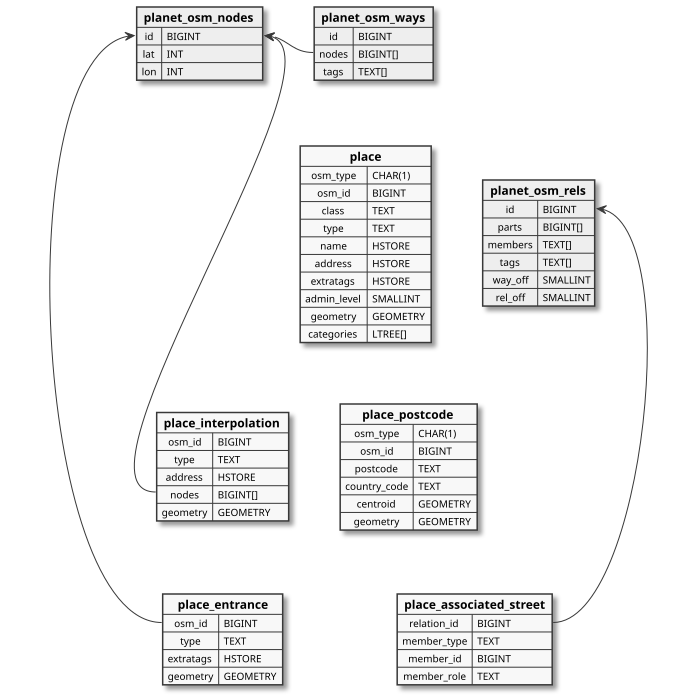
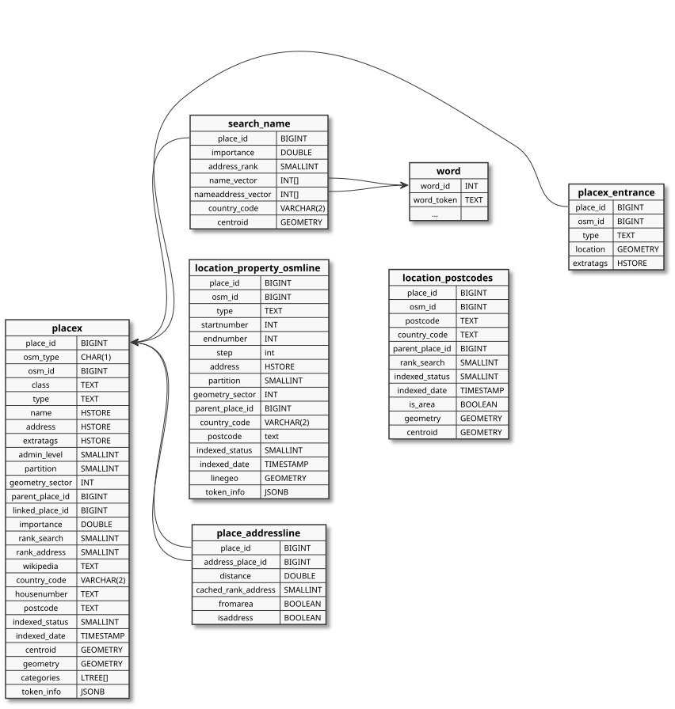

# Database Layout

### Import tables

OSM data is initially imported using [osm2pgsql](https://osm2pgsql.org).
Nominatim uses a custom flex style to create the initial import tables.

The import process creates the following tables:

The `planet_osm_*` tables are the usual backing tables for OSM data. Note
that Nominatim uses them to look up special relations and to find nodes on
ways. Apart from those the osm2pgsql import produces five tables as output.

The **place_postcode** table collects postcode information that is not
already present on an object in the place table. That is for one thing
[postcode area relations](https://wiki.openstreetmap.org/wiki/Tag:boundary%3Dpostal_code)
and for another objects with a postcode tag but no other tagging that
qualifies it for inclusion into the geocoding database.

The table has the following fields:

 * `osm_type` - kind of OSM object (**N** - node, **W** - way, **R** - relation)
 * `osm_id` - original OSM ID
 * `postcode` - postcode as extacted from the `postcal_code` tag
 * `country_code` - computed country code for this postcode. This field
   functions as a cache and is only computed when the table is used for
   the computation of the final postcodes.
 * `centroid` - centroid of the object
 * `geometry` - the full geometry of the area for postcode areas only

The **place_interpolation** table holds all
[address interpolation lines](https://wiki.openstreetmap.org/wiki/Addresses#Interpolation)
and has the following fields:

 * `osm_id` - original OSM ID
 * `type` - type of interpolation as extracted from the `addr:interpolation` tag
 * `address` - any other `addr:*` tags
 * `nodes` - list of OSM nodes contained in this interpolation,
    needed to compute the involved housenumbers later
 * `geometry` - the linestring for the interpolation (in WSG84)

The **place** table holds all other OSM object that are interesting and
has the following fields:

 * `osm_type` - kind of OSM object (**N** - node, **W** - way, **R** - relation)
 * `osm_id` - original OSM ID
 * `class` - key of principal tag defining the object type
 * `type` - value of principal tag defining the object type
 * `name` - collection of tags that contain a name or reference
 * `admin_level` - numerical value of the tagged administrative level
 * `address` - collection of tags defining the address of an object
 * `extratags` - collection of additional interesting tags that are not
                 directly relevant for searching
 * `geometry` - geometry of the object (in WGS84)
 * `categories` - all principal tags of the object, each one as a hierarchical
                  label of the form `osm.<key>.<value>`

An OSM object appears at most once in this table, even when it is tagged with
more than one tag that may constitute a principal tag. Take for example a
motorway bridge. In OSM, this would be a way which is tagged with
`highway=motorway` and `bridge=yes`. This way gets a single row in the `place`
table with `categories` of `{osm.highway.motorway, osm.bridge.yes}`. The
*unique key* for `place` is therefore (`osm_type`, `osm_id`).

The `class` and `type` columns still hold a single principal tag, the one that
Nominatim uses to classify and rank the place. When an object has more than one
principal tag, then the alphabetically first key/value pair wins. Tags that are
only used as a fallback (see [Import styles](../customize/Import-Styles.md#main-tags))
contribute a category but never become `class` and `type` unless they are the
only principal tag of the object.

How raw OSM tags are mapped to the columns in the place table is to a certain
degree configurable. See [Customizing Import Styles](../customize/Import-Styles.md)
for more information.

The **place_entrance** table collects the nodes that are tagged as an entrance
of a building or another feature. Nominatim does not make them searchable but
returns them together with the enclosing place. The table has the following
fields:

 * `osm_id` - original OSM ID of the node
 * `type` - value of the `entrance` tag
 * `extratags` - any other tags of the entrance that may be interesting
 * `geometry` - position of the node (in WGS84)

The **place_associated_street** table saves the members of
[associatedStreet relations](https://wiki.openstreetmap.org/wiki/Relation:associatedStreet).
They are used to find the street a housenumber belongs to when no `addr:street`
tag can be matched. The table has the following fields:

 * `relation_id` - OSM ID of the relation
 * `member_type`, `member_id` - reference to the OSM object that is a member
   of the relation
 * `member_role` - role of the member within the relation, usually `house`
   or `street`

### Search tables

The following tables carry all information needed to do the search:

The **placex** table is the central table that saves all information about the
searchable places in Nominatim. 

In simpler terms, the `placex` table can be seen as the final, processed version of OSM data that is ready for search.
While the `place` table contains raw imported data, `placex` stores enriched and indexed data that includes ranking, hierarchy (parent-child relationships), and computed metadata such as importance and postcode.
Most search queries in Nominatim ultimately read from this table, making it the core table for forward and reverse geocoding.

The basic columns are the same as for the
place table and have the same meaning. The placex tables adds the following
additional columns:

 * `place_id` - the internal unique ID to identify the place
 * `partition` - the id to use with partitioned tables (see below)
 * `geometry_sector` - a location hash used for geographically close ordering
 * `parent_place_id` - the next higher place in the address hierarchy, only
   relevant for POI-type places (with rank 30)
 * `linked_place_id` - place ID of the place this object has been merged with.
   When this ID is set, then the place is invisible for search.
 * `importance` - measure how well known the place is
 * `rank_search`, `rank_address` - search and address rank (see [Customizing ranking](../customize/Ranking.md)
 * `wikipedia` - the wikipedia page used for computing the importance of the place
 * `country_code` - the country the place is located in
 * `housenumber` - normalized housenumber, if the place has one
 * `postcode` - computed postcode for the place
 * `indexed_status` - processing status of the place (0 - ready, 1 - freshly inserted, 2 - needs updating, 100 - needs deletion)
 * `indexed_date` - timestamp when the place was processed last
 * `centroid` - a point feature for the place
 * `token_info` - a dummy field used to inject information from the tokenizer
   into the indexing process

The `categories` column is copied from the place table. It is an array of
`ltree` values, so that a search for a category can use the containment
operator `<@` and match all descendants of a category with a single comparison.
The combined index `idx_placex_centroid_categories` over `centroid` and
`categories` backs the search for POIs of a given category around a point.

For implementation details, see the SQL definition in `lib-sql/tables/placex.sql` and the SQLAlchemy schema in `src/nominatim_api/sql/sqlalchemy_schema.py`.

The **placex_entrance** table holds the entrances that could be assigned to a
place, that is all entrance nodes that are part of the way of a place. The
columns have the same meaning as in `place_entrance` with the exception of:

 * `place_id` - reference to the place the entrance belongs to
 * `location` - position of the entrance node

The **location_property_osmline** table is a special table for
[address interpolations](https://wiki.openstreetmap.org/wiki/Addresses#Using_interpolation).
The columns have the same meaning and use as the columns with the same name in
the placex table. Only the following columns are special:

 * `startnumber`, `endnumber` and `step` - beginning and end of the number range
    for the interpolation and the increment steps
 * `type` - a string to indicate the interval between the numbers as imported
   from the OSM `addr:interpolation` tag; valid values are `odd`, `even`, `all`
   or a single digit number; interpolations with other values are silently
   dropped

Address interpolations are always ways in OSM, which is why there is no column
`osm_type`.

The **location_postcodes** table holds computed postcode assembled from the postcode information
available in OSM. When a postcode has a postcode area relation, or when the postcode geometry is
[imported via JSONL files](../customize/Postcodes.md#jsonl-format) then the table stores
its full geometry. For all other postcodes the centroid is computed using the position of all OSM
objects that reference the same postcode. The `osm_id` and `is_area` fields can be used to
distinguish the two. When `osm_id` is set, it refers to the OSM relation with the postcode area,
and `is_area` is `true` for postcodes with a mature geometry (either from a postcode OSM area
relation or imported via JSONL), `false` for postcodes without a mature geometry (guessed
postcode geometries). The meaning of other columns in the table is again the same as that of the
placex table.

Every place needs an address, a set of surrounding places that describe the
location of the place. The set of address places is made up of OSM places
themselves. The **place_addressline** table cross-references for each place
all the places that make up its address. Two columns define the address
relation:

  * `place_id` - reference to the place being addressed
  * `address_place_id` - reference to the place serving as an address part

The most of the columns cache information from the placex entry of the address
part. The exceptions are:

  * `fromarea` - is true if the address part has an area geometry and can
    therefore be considered preceise
  * `isaddress` - is true if the address part should show up in the address
    output. Sometimes there are multiple places competing for for same address
    type (e.g. multiple cities) and this field resolves the tie.

The **search_name** table contains the search index proper. It saves for each
place the terms with which the place can be found. The terms are split into
the name itself and all terms that make up the address. The table mirrors some
of the columns from placex for faster lookup.

Search terms are not saved as strings. Each term is assigned an integer and those
integers are saved in the name and address vectors of the search_name table. The
**word** table serves as the lookup table from string to such a word ID. The
exact content of the word table depends on the [tokenizer](Tokenizers.md) used.

## Address computation tables

Next to the main search tables, there is a set of secondary helper tables used
to compute the address relations between places. These tables are partitioned.
Each country is assigned a partition number in the country_name table (see
below) and the data is then split between a set of tables, one for each
partition. Note that Nominatim still manually manages partitioned tables
instead of using PostgreSQL's native partitioning.

The **search_name_X** tables are used to look up streets that appear in the
`addr:street` tag.

The **location_area_large_X** tables are used to look up larger areas
(administrative boundaries and place nodes) either through their geographic
closeness or through `addr:*` entries.

The **location_road_X** tables are used to find the closest street for a
dependent place.

All three table cache specific information from the placex table for their
selected subset of places:

 * `keywords` and `name_vector` contain lists of term ids (from the word table)
   that the full name of the place should match against
 * `isguess` is true for places that are not described by an area

All other columns reflect their counterpart in the placex table.

The **location_area_country** table is not partitioned. It caches the
geometries of the country boundaries found in the data and is used to determine
the country a place is located in.

## Static data tables

Nominatim also creates a number of static tables at import:

 * `nominatim_properties` saves settings that must not be changed after
    import
 * `address_levels` save the rank information from the
   [ranking configuration](../customize/Ranking.md)
 * `country_name` contains a fallback of names for all countries, their
   default languages and saves the assignment of countries to partitions.
 * `country_osm_grid` provides a fallback for country geometries

## Auxiliary data tables

Finally there are some table for auxiliary data:

 * `location_property_tiger` - saves housenumber from the Tiger import. Its
   layout is similar to that of `location_propoerty_osmline`.
 * `import_polygon_error` - logs objects whose geometry was too broken to be
   processed during an update
 * `import_polygon_delete` - logs deletions of very large areas, which
   Nominatim refuses to apply automatically, see
   [Maintenance](../admin/Maintenance.md#removing-large-deleted-objects)

